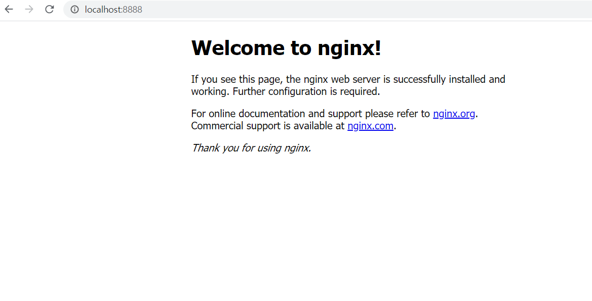

# images


# 3번 문제 k8s.sh 파일
```
kubectl run k8s --image=32111666a/nginx2 --port=80
kubectl.exe get po
kubectl scale deployment k8s --replicas=20
```

# 3번 문제 예시
```
user@DESKTOP-14530KF MINGW64 ~/0626/msa (master)
$ kubectl run k8s --image=32111666a/nginx2 --port=80
kubectl run --generator=deployment/apps.v1 is DEPRECATED and will be removea future version. Use kubectl run --generator=run-pod/v1 or kubectl create ad.
deployment.apps/k8s created

user@DESKTOP-14530KF MINGW64 ~/0626/msa (master)
$ kubectl.exe get po
NAME                        READY   STATUS             RESTARTS   AGE
httpd-4w94k                 1/1     Running            0          143m
k8s-6ccf757d98-n4lqz        1/1     Running            0          16s
myubuntu-64f97cfc9f-vrkcc   0/1     ImagePullBackOff   0          70m
nginx-7c45b84548-5bmzv      1/1     Running            0          4h14m
nginx-7c45b84548-6sqpj      1/1     Running            0          129m
nginx-7c45b84548-7dv8j      1/1     Running            0          129m
nginx-7c45b84548-9pr8j      1/1     Running            0          129m
nginx-7c45b84548-n5zcg      1/1     Running            0          129m
nginx-7c45b84548-pm8tq      1/1     Running            0          4h42m
nginx-7c45b84548-pnp6f      1/1     Running            0          4h14m
nginx-7c45b84548-tqttf      1/1     Running            0          129m
nginx-7c45b84548-vghw7      1/1     Running            0          129m
nginx-7c45b84548-x7cpb      1/1     Running            0          129m

user@DESKTOP-14530KF MINGW64 ~/0626/msa (master)
$ kubectl scale deployment k8s --replicas=20
deployment.extensions/k8s scaled

user@DESKTOP-14530KF MINGW64 ~/0626/msa (master)
$ kubectl.exe get po
NAME                        READY   STATUS              RESTARTS   AGE
httpd-4w94k                 1/1     Running             0          144m
k8s-6ccf757d98-2p4l8        1/1     Running             0          21s
k8s-6ccf757d98-47rjn        0/1     ContainerCreating   0          21s
k8s-6ccf757d98-4zn48        0/1     ContainerCreating   0          21s
k8s-6ccf757d98-52chf        0/1     ContainerCreating   0          21s
k8s-6ccf757d98-7wgnv        1/1     Running             0          21s
k8s-6ccf757d98-cmg7t        0/1     ContainerCreating   0          21s
k8s-6ccf757d98-d8g9m        0/1     ContainerCreating   0          21s
k8s-6ccf757d98-fb7km        0/1     ContainerCreating   0          21s
k8s-6ccf757d98-hgs46        1/1     Running             0          21s
k8s-6ccf757d98-kqzjz        0/1     ContainerCreating   0          21s
k8s-6ccf757d98-mc4l7        0/1     ContainerCreating   0          21s
k8s-6ccf757d98-n4lqz        1/1     Running             0          85s
k8s-6ccf757d98-n7zzp        0/1     ContainerCreating   0          21s
k8s-6ccf757d98-nb9tb        0/1     ContainerCreating   0          21s
k8s-6ccf757d98-q98pk        1/1     Running             0          21s
k8s-6ccf757d98-qxmcx        0/1     ContainerCreating   0          21s
k8s-6ccf757d98-wlk2d        0/1     ContainerCreating   0          21s
k8s-6ccf757d98-wnndn        1/1     Running             0          21s
k8s-6ccf757d98-ws964        1/1     Running             0          21s
k8s-6ccf757d98-zdhvd        0/1     ContainerCreating   0          21s
myubuntu-64f97cfc9f-vrkcc   0/1     ImagePullBackOff    0          71m
nginx-7c45b84548-5bmzv      1/1     Running             0          4h16m
nginx-7c45b84548-6sqpj      1/1     Running             0          130m
nginx-7c45b84548-7dv8j      1/1     Running             0          130m
nginx-7c45b84548-9pr8j      1/1     Running             0          130m
nginx-7c45b84548-n5zcg      1/1     Running             0          130m
nginx-7c45b84548-pm8tq      1/1     Running             0          4h43m
nginx-7c45b84548-pnp6f      1/1     Running             0          4h16m
nginx-7c45b84548-tqttf      1/1     Running             0          130m
nginx-7c45b84548-vghw7      1/1     Running             0          130m
nginx-7c45b84548-x7cpb      1/1     Running             0          130m
